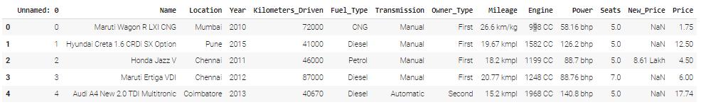

# Second-Hand Cars' Price Prediction Using Random Forest, Decision Tree, Linear Regression and XGBoost

## Project Objectives
This project aims to predict the prices of second-hand cars in Nigeria using machine learning techniques. The project will involve building and evaluating different regression models, including linear regression, decision tree regression, and random forest regression, Xgboost. The models will be trained on a dataset containing information about the year of manufacture, kilometers driven, seats, and other relevant features of a large number of second-hand cars sold. The project objective is to achieve high accuracy in predicting the prices of second-hand cars based on these features, which can help buyers and sellers make more informed decisions and improve overall market efficiency in Nigeria.

## Project Structure
- `CarPriceApp/` - Holds the contents of the Django app .
- `SecondHandCarPrice/` - Holds the contents of the Django folder.
- `README.md/` - Holds the steps taken to develop the model
- `Requirements.txt/` - Holds contents of the required libraries.
- `db.sqlite` - Holds Django database.
- `image.png` - Holds an image of the dataset.
- `manage.py` - Holds files that interface with the prediction functions.
- `train-data.csv` - Holds the training dataset

## Generating model artifacts
To run the notebook, you need to have Visual Studio Code or Jupyter Notebook installed on your computer. On Visual Studio Code, use the `Jupyter` extension from Marketplace to power up a kernel.

### Installing dependencies
The following packages are required to run the notebook:

- pandas
- numpy
- matplotlib
- sklearn
- keras
- seaborn

## Collecting metrics
The performance of each model was evaluated using the Mean Square Error and R2 Score metric. The higher R2 Score, the better the model's performance.

## Conclusion
Overall, the best model for predicting the car prices was the Random Forest model, with a R2 score of 86.3%. The Decision Tree model had a R2 score of 73.2%,  The linear regression had a R2 score of 56.3%, while the XGBoost model had an R2 score of 64.15%

# How the Models were developed

## Step 1: Import the necessary libraries
- import pandas as pd
-  numpy as np
- from sklearn.model_selection import train_test_split
- from sklearn.ensemble import RandomForestRegressor
- from sklearn.metrics import mean_squared_error
- from sklearn.preprocessing import StandardScaler

## Step 2: Load and preprocess the dataset 
- df = pd.read_csv("/content/train-data.csv")

- df.head()

## Step 3: Select the columns that you need
- selected_features = ['Year', 'Kilometers_Driven',  'Transmission', 'Owner_Type', 'Engine', 'Power', 'Seats', 'Price']

[ Create a mapping dictionary to replace categorical values with numerical values]:#
- Transmission = {'Manual': 0, 'Automatic': 1}

[Replace the values in the 'Tranmission' column with the numerical representation]: #
- df['Transmission'] = df['Transmission'].replace(Transmission)

[Create a mapping dictionary to replace categorical values with numerical values ]:#
- Owner_Type = {'First': 0, 'Second': 1, 'Third': 2, 'Fourth & Above': 3}

[Replace the values in the 'Tranmission' column with the numerical representation]:# 
- df['Owner_Type'] = df['Owner_Type'].replace(Owner_Type)

[ Create a dataframe with the selected columns]:# 
- new_dataset = df[selected_features]
  
[To print the 'new_dataset']:#
new_dataset 

## Step 4:  Preprocessing The Dataset 
The codes in this section helps to perform data preprocessing operations on the dataset. These operations include removing null values, generating the mode of a column to fill the null values. 

[Preprocessing the Seats Column]: # 
This code finds the mode of the 'Seats' Colum and then fill the missing values in the 'Seats' Column with the mode value

[ Find the mode of the 'Seats' column]:# 
- mode_seats = new_dataset['Seats'].mode()[0]
  
[Print the mode value]: #
- print("Mode of 'Seats' column:", mode_seats)

[Fill the missing values in 'Seats' column with the mode value ]:# 
- new_dataset['Seats'].fillna(mode_seats, inplace=True)

[** _Now, the missing values in the 'Seats' column have been replaced with the mode value._**]:# 

[Verify that there are no more missing values in the 'Seats' column ]:# 
- print("Null Values in the 'Seats' Column After Filling:")
- print(new_dataset['Seats'].isnull().sum())

[**Preprocesing the Power column**]:#
This code remove 'bhp' from the 'Power' colum and then converts it to a numeric data type.

[ **Remove 'bhp' from the 'Power' column** ]:# 
- new_dataset['Power'] = df['Power'].str.replace(' bhp', '', regex=True)

[ **Convert the 'Power' column to numeric dtype (float or int)**]: # 
- new_dataset['Power'] = pd.to_numeric(new_dataset['Power'], errors='coerce')

[_'coerce' argument will convert non-numeric values (e.g., NaN) to NaN._ ]:# 

[**Verify the 'Power' column after the transformation**]:# 
- print(new_dataset['Power'])

[ **Removing missing values from the Power column**]:#
This code finds the mode of the 'Power' Colum and then fill the missing values in the 'Power' Column with the mode value

[**Find the mode of the 'Seats' column**]:# 
- mode_power = new_dataset['Power'].mode()[0]

[Print the mode value]:# 
- print("Mode of 'Power' column:", mode_power)

[**Fill the missing values in 'Power' column with the mode value** ]:# 
- new_dataset['Power'].fillna(mode_power, inplace=True)

[ Verify that there are no more missing values in the 'Power' column]:#  
- print("Null Values in the 'Power' Column After Filling:")
- print(new_dataset['Power'].isnull().sum())

[Remove 'CC' from the 'Engine' column ]:# 
- new_dataset['Engine'] = df['Engine'].str.replace(' CC', '', regex=True)

[ Convert the 'Engine' column to numeric dtype (float or int) ]:# 
- new_dataset['Engine'] = pd.to_numeric(new_dataset['Engine'], errors='coerce')

[Verify the 'Engine' column after the transformation ]:# 
- print(new_dataset['Engine'])

[Removing null values from the Engine column and filling it with the mode ]:#
The code bleow finds the mode of the Engine column, prints the mode value, and then fill the missing values

[Find the mode of the 'Engine' column ]:# 
- mode_engine = new_dataset['Engine'].mode()[0]

[Print the mode value ]:# 
- print("Mode of 'Engine' column:", mode_engine)

[Fill the missing values in 'Egine' column with the mode value ]:# 
- new_dataset['Engine'].fillna(mode_engine, inplace=True)

[Verify that there are no more missing values in the 'Engine' column ]:# 
- print("Null Values in the 'Engine' Column After Filling:")
- print(new_dataset['Engine'].isnull().sum())

[Check for null values in the entire DataFrame ]:# 
- null_values = new_dataset.isnull().sum()
  
[ This code prints the null values]:#
null_values

[ This code prints the new_dataset ]:#
new_dataset

# Step 5: Split the dataset into features (X) and target variable (y)
- X = new_dataset.drop('Price', axis =1)
- y = new_dataset['Price']
[This shows the feature variable]:#
X

# Step 6:  Split the dataset into training and testing sets
X_train, X_test, y_train, y_test = train_test_split(X, y, test_size=0.2, random_state=42)

- X_train: This is the feature matrix for the training data. It contains the input features (independent variables) that the model will - use to learn patterns and relationships. Each row represents a sample, and each column represents a different feature.

- y_train: This is the target vector for the training data. It contains the corresponding labels or target values (dependent variable) for the training samples in X_train. The model learns to map the input features in X_train to the target values in y_train.

- X_test: This is the feature matrix for the test data. It contains a separate set of input features that the model has not seen during training. The purpose of the test set is to evaluate how well the model generalizes to new, unseen data.

- y_test: This is the target vector for the test data. It contains the corresponding labels or target values for the test samples in X_test. 

# Step 7: Preprocessing the X_train and y_train
[Drop rows with missing values in X_train and y_train ]:# 
- X_train.dropna(inplace=True)
- y_train = y_train[X_train.index]

from sklearn.impute import SimpleImputer
[ Create an imputer instance]:# 
- imputer = SimpleImputer(strategy='mean')

[Fit and transform the imputer on X_train]:# 
- X_train_imputed = imputer.fit_transform(X_train)

[Convert the imputed data back to a DataFrame ]:# 
- X_train = pd.DataFrame(X_train_imputed, columns=X_train.columns)

# Step 8: Preprocessing the X_test and y_test
[ Drop rows with missing values in X_test and y_test]:# 
- X_test.dropna(inplace=True)
- y_test = y_test[X_test.index]

[Assuming X_test is a DataFrame containing the test features ]:# 
[Adjust the DataFrame name and column names accordingly ]:#

[Drop the Mileage column in the X_test]:# 
- X_test.drop('Mileage', axis=1, inplace=True)

[Display the updated X_test DataFrame ]:# 
- print(X_test)

from sklearn.impute import SimpleImputer
[ Create an imputer instance]:# 
- imputer = SimpleImputer(strategy='mean')

[Fit and transform the imputer on X_train ]:# 
- X_test_imputed = imputer.fit_transform(X_test)

[ Convert the imputed data back to a DataFrame]:# 
- X_test = pd.DataFrame(X_test_imputed, columns=X_test.columns)

# Step 9: Develop the Random Forest model 
[Random Forest Regressor]:# 
- from sklearn.ensemble import RandomForestRegressor
- from sklearn.metrics import r2_score
- from sklearn.metrics import mean_squared_error
  [Create the model ]:#
- rf_model = RandomForestRegressor(random_state=42)
- rf_model.fit(X_train, y_train)

[Train and Evaluate the Random Forest Regressor]:# 
- rf_predictions = rf_model.predict(X_test)
- rf_mse = mean_squared_error(y_test, rf_predictions)
- print("Random Forest Mean Squared Error:", rf_mse)
- rf_r2_score = r2_score(y_test, rf_predictions)
- print("Random Forest R2_score:", rf_r2_score)

  

[Save the model as a pickle file in the Colab environment]:# 
- import pickle
- file_path = "/content/Random_Forest_Model"  # Specify a path in Colab environment
- with open(file_path, "wb") as file:
    - pickle.dump(rf_model, file)

- from google.colab import files

[Download the pickled model from Colab to your local machine]:# 
- files.download(file_path)

# Step 10: Create a Decision Tree Regressor
- from sklearn.tree import DecisionTreeRegressor
- decision_tree = DecisionTreeRegressor()
  
## Train the model
- decision_tree.fit(X_train, y_train)

## Make predictions on the test data
- dt_predictions = decision_tree.predict(X_test)
- dt_mse = mean_squared_error(y_test, dt_predictions)
- print("Decision Tree Mean Squared Error: ", dt_mse)
- dt_r2score = r2_score(y_test, dt_predictions)
- print("Decision Tree R2 Score: ", dt_r2score)

# Step 11:  Create a Linear Regression model
from sklearn.linear_model import LinearRegression
linear_regression = LinearRegression()

## Train the model
- linear_regression.fit(X_train_scaled, y_train)

## Make predictions on the scaled test data
- linear_predictions = linear_regression.predict(X_test_scaled)
- lr_mse = mean_squared_error(y_test, linear_predictions)
- print("Linear Regression Mean Squared Error: ", lr_mse)
- lr_r2score = r2_score(y_test, linear_predictions)
- print("Linear Regression R2 Score: ", lr_r2score)

# Step 12: Developing the XGBoost model
[ Install the xgboost package]:# 
- !pip install xgboost
- import xgboost as xgb
- from sklearn.metrics import mean_squared_error

## Create a DMatrix for the training and test data
dtrain = xgb.DMatrix(X_train, label=y_train)
dtest = xgb.DMatrix(X_test)

##  Define the XGBoost parameters
- params = {
    'objective': 'reg:squarederror',
    'eval_metric': 'rmse',
    'max_depth': 6,
    'learning_rate': 0.1,
    'n_estimators': 100,
    'subsample': 0.8,
    'colsample_bytree': 0.8,
    'seed': 42
}

## Create the XGBoost model
- xgb_model = xgb.train(params, dtrain)

## Make predictions on the test data
xgb_predictions = xgb_model.predict(dtest)

## Calculate the mean squared error (MSE) and the R2 Score
- mse = mean_squared_error(y_test, xgb_predictions)
- print(f"Mean Squared Error: {mse}")
- r2score = r2_score(y_test, xgb_predictions)
- print(f"R2 Score: {r2score}")

## Plot the graph to compare the models
- import matplotlib.pyplot as plt
- r2_scores = [0.863, 0.732, 0.563, 0.641]
- algorithms = ['Random Forest', 'Decision Tree', 'Linear Regression', 'XGBoost']
- plt.bar(algorithms, r2_scores)
- plt.xlabel('Algorithm')
- plt.ylabel('R2 Score')
- plt.title('R2 Score Comparison of Different Algorithms')
- plt.ylim(0, 1)  # Set the y-axis limits from 0 to 1
- plt.show()
  

## Saving and Downloading the Pickled model
import pickle

[Step 1: Load the model from the file]:# 
- For example, if you have a scikit-learn model saved in a file called 'model_file.pkl':
- with open('/content/Random_Forest_Model', 'rb') as file:
    - loaded_model = pickle.load(file)

[Step 2: Serialize the model into a pickled file]:#
- For example, to save the loaded model into a new pickled file called 'pickled_model.pkl':
- with open('pickled_model.pkl', 'wb') as file:
    - pickle.dump(loaded_model, file)

- from google.colab import files

## Download the pickled file to your local machine
- files.download('pickled_model.pkl')

# How to View the Deployed model using Django
## Step 1: Open your command prompt
Go to your type section and then type cmd. This will open the command prompt

## Step 2: Navigate to the path where your folder is

## Step 3: Run the server using the command on the picture below

# Step 4: Copy the link below and paste it on your web browser. It will show the image below

Run the  server at:  http://127.0.0.1:8000/

